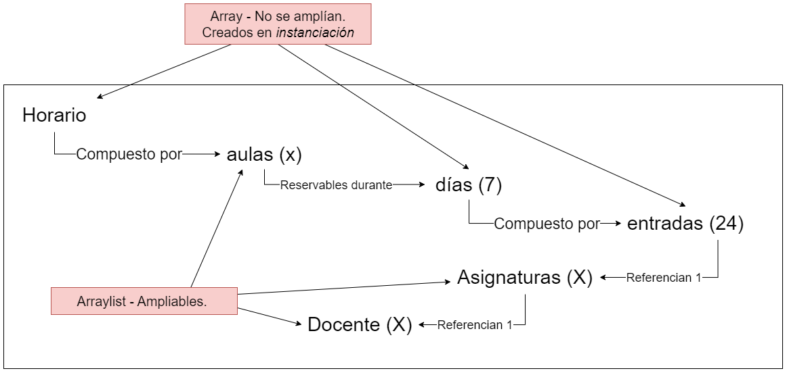

**Actividad de**
# CGIS-I2P // Introducción a la Programación

## Gestor de Horarios

El proyecto consiste en el desarrollo de una aplicación denominada "Gestor de Horarios".

Se desea desarrollar una aplicación que permita gestionar la información relativa al horario semanal de las asignaturas de un curso. Para ello, hay dos grandes grupos de datos que la aplicación debe permitir gestionar. 

Por un lado, la definición de las asignaturas que componen el horario. Los datos relativos a cada asignatura incluyen, al menos, los siguientes campos: código y nombre de la asignatura, total de horas semanales, máximo de horas al día. 

Por otro lado, las diferentes entradas del horario, que deben contener al menos: día de la semana, hora de inicio y fin, asignatura, aula, profesor. Una asignatura puede tener varias entradas semanales.

Se ha elegido la siguiente estructura para la aplicación:

El trabajo está disponible en el archivo [TrabajoI2P.pdf](./TrabajoI2P.pdf)